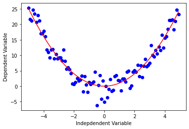
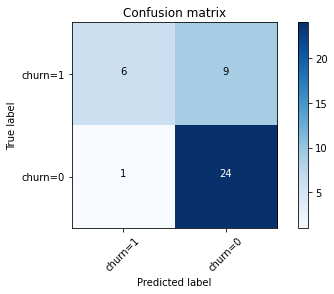

# Digital Portfolio

---

## Data Science Projects (Research/Academia):

[1. Data Collection and Research Domain:](/DataCollection_page)

---
[2. Data Analysis & Feature Selection:](/DataAnalysis)

---
[3. Sensor Reliability Analysis via ROC Curves:](/ROCanalysis)

---
[4. Sensor Reliability Analysis via POD Curves (Using R):](/pod)

---
[5. Research Results:](/results)

---
[6. Research References (EndNote):](/pdf/references.pdf)

---

## Data Science Projects (Industry):

[1. Machine Learning:](https://courses.edx.org/certificates/101c0b6e610c4881b92cb0d8b50f967e)

  
   

 

  
  

  
  

  * Fuel Consumption & CO2 Emmission Project:
    * [Linear Regression](MachineLearning/01)
    * [Multiple Linear Regression](MachineLearning/02)
    * [Polynomial Regression](MachineLearning/03) 
    * [Non-Linear Regression](MachineLearning/04) 
  
  * [Patients Historical Data Analysis (Decision Trees)](MachineLearning/05)
  
  * [Customer Churn Analysis for a Telecommunication Company (Logistic Regression)](MachineLearning/06)
